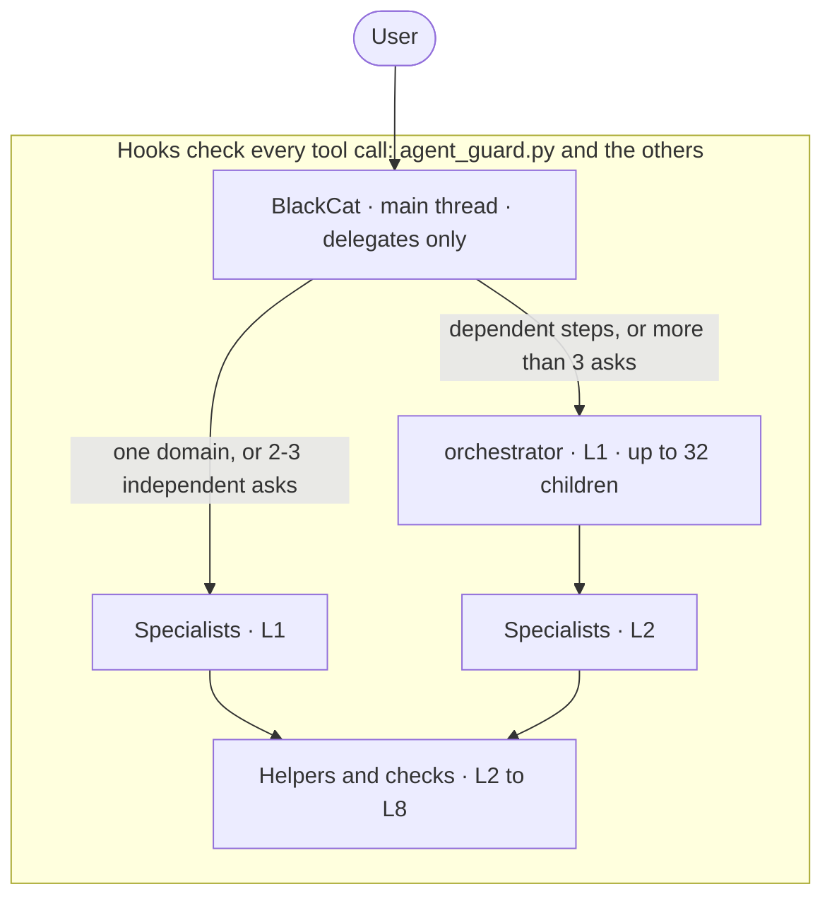

<!-- markdownlint-disable MD013 MD060 -->
# Architecture

You talk to BlackCat. BlackCat does no work itself: it classifies each ask and dispatches it to a specialist, or to
the orchestrator when the work has dependent parts. Specialists may spawn helpers, down to level 8. One policy
hook, `agent_guard.py`, checks every tool call of every agent at every level, and the Claude Code sandbox and deny
rules hold the limits underneath it.

The same diagram, with the stack's colours, is `docs/diagrams/architecture.mmd` (source) and
`docs/diagrams/architecture.svg` in the repository.

## BlackCat: the main thread only delegates

`settings.json` sets `"agent": "blackcat"`, so `claude` starts as BlackCat (`dot-claude/agents/blackcat.md`, model
`sonnet`). Its rules, in the order the file gives them:

1. **Decide.** An `@<agent>` or `<agent>:` prefix goes to that agent verbatim; a follow-up goes back to the same
   agent by `SendMessage`; otherwise BlackCat classifies by deliverable: one domain → that specialist, 2–3
   independent asks → one specialist each, dependent steps or more than 3 asks → one orchestrator call. It answers
   only greetings, setup questions and "who is working on what" (from the delegation ledger) itself.
2. **Ask first** with one AskUserQuestion call when the answer changes what gets built (format, scope, costly
   options, anything destructive).
3. **Plan mode**: sessions start in Plan; BlackCat sends the planner, relays its plan and calls ExitPlanMode.
   Builders go out only after you approve, because builders edit even in Plan (a prompt rule).
4. **Route, cheapest capable first**: oracle < scout < researcher for knowledge; coder < main-coder < ninja-coder
   for code (ninja-coder is the top tier); language-heavy work to a language engineer; domain builds to the
   domain expert; installs to toolsmith.
5. **Relay** each result as it lands; a child's `NEXT: ASK USER` becomes an AskUserQuestion, and the answer goes
   back to the same agent id. This is the only path for consent to a destructive or external action.

What enforces "delegate only" (CONFIG §5, `STACK_BLACKCAT_DELEGATE_ONLY`):

| Layer | Limit |
|---|---|
| Tools line | `Agent(...)` over the 56 specialists, SendMessage, AskUserQuestion, ExitPlanMode, TaskStop, ListAgents, ToolSearch, Skill, Workflow, the Cron and wake-up tools, RemoteTrigger, PushNotification, SendUserFile, Read; no Bash, Write, Edit or web tools |
| `blackcat-guard` hook | refuses any other tool call that still reaches it, fail-closed, also with `STACK_POLICY=off` (only `STACK_BLACKCAT_DELEGATE_ONLY=0` lifts it) |
| Per-prompt caps | 24 tool calls, dispatches included (`BLACKCAT_MAX_STEPS`); every dispatch must start within 120 s of the first, one parallel burst (`BLACKCAT_DISPATCH_WINDOW_S`); at most 3 Read calls (`BLACKCAT_MAX_READS`) |
| Background children | the hook drops `run_in_background: false` from BlackCat's calls (`BLACKCAT_BACKGROUND`), which fixed a Desktop hang (CONFIG §1, bug 1) |
| Reply check | a Stop hook logs a BlackCat turn that ends without text to `reply-check.jsonl`; it never blocks |

Any other agent started as the main thread (`claude --agent claude`, `claude --agent main-coder`, the
`claude-ninja` launcher) keeps all its tools: the restriction belongs to BlackCat only.

## Layers, depth and fan-out

| Level | Who runs there | Limit (enforced by) |
|---|---|---|
| Main thread | BlackCat | the caps above (guard) |
| L1 to L7 | any agent whose `POLICY` row allows the spawn | 3 running children per agent by default; orchestrator 32, planner 8, plan-reviewer 8, main-coder 6, ninja-coder 5, researcher 4 (`STACK_MAX_FANOUT`, `STACK_MAX_FANOUT_BY_TYPE`); 128 subagents at once per session (`CLAUDE_CODE_MAX_CONCURRENT_SUBAGENTS`) |
| L8 | leaves by position | cannot spawn (`CLAUDE_CODE_MAX_SUBAGENT_SPAWN_DEPTH=8`, enforced by Claude Code) |

- **Spawn policy.** `POLICY` in `agent_guard.py` is the source of truth: a `subagent_type` must name a stack agent
  in the caller's row. Generic and built-in types (`general-purpose`, `claude`, `fork`, `Plan`), missing and
  unknown types are refused for every caller; `settings.json` also denies `Agent(general-purpose)`,
  `Agent(claude)`, `Agent(fork)` and `Agent(blackcat)`. Each agent's "May spawn" sentence must match its row
  (`tests/lint_agents.py`). The rows are on the [Agents](Agents.md) page.
- **Depth is a ceiling, not a target** (a prompt rule): L1 fans out; L2 and L3 spawn only for a missing capability
  or a check; L4 to L7 only when their brief names the spawn. Briefs below L1 carry `Layer: L<n>`, `Why:`, the
  files the child owns, its artifact paths and its integrator. The full rules are in
  `dot-claude/skills/prompt-and-brief-design/references/delegation.md`, which subagents read before their first
  spawn.
- **Escalation.** Code goes coder → main-coder → ninja-coder. An agent that cannot spawn the next tier returns
  `STATUS: partial` with `NEXT: <agent>` and a dossier; ninja-coder failing twice ends in `STATUS: partial`.

## Messages: no peer-to-peer

A subagent's `SendMessage` reaches only `main`, its own child, or its own parent while that parent runs, and is
addressed by agent id (a name is refused). Every subagent message is stamped
`[from <type> <id>: an agent, not the user]`; a `USER:` line passes only from the main thread or a parent to its
own child, which is how your answer travels back down the chain. Results move as files the brief names, and the
orchestrator owns a job's graph. Source: CONFIG §4 "SendMessage hook", `tests/test_send_routing.py`.

## The delegation ledger

The guard records every Agent call as a tree (type, task, state, agent id) under
`~/.local/state/claude-agent-stack/<session>/`: one record per spawn in `spawns/`, the agent registry in
`agents/`, rendered to `delegations.md`, which BlackCat reads when you ask who is working on what.

| To see | Use |
|---|---|
| The ledger as recorded | `/usr/bin/python3 ~/.claude/hooks/agent_guard.py delegations [session] [--json]` |
| The live tree with each agent's commands and tokens | `/stack-tree` (also `table`, `static`) |
| Who is running in this shell's session | `stack-who` |
| Limits in force and use so far | `stack-budget` |

Before a compaction, a PreCompact hook snapshots the ledger with the running and unrelayed children into
`<session>/compact/`; after it, SessionStart (`compact`) re-renders them into the new context (at most 9,000
characters, full list in `compact/post.md`).

## Hand-backs

Every agent ends with either a one-line clean finish (`<input> · <YYYY-MM-DD HH:MM> · <agent type>` and the
result) or a block with `STATUS / RESULT / EVIDENCE / FILES / NEXT` (global rules, "Briefs and hand-backs").
SubagentStop checks and records each spawned stack subagent's final report, including a `SubagentHandback`
message, in `usage/reports.jsonl` and the session's `reports/` folder. The default mode, `observe`, never changes
a prompt, a reply or a decision (CONFIG §5 "Message protocol").

## Models and permission modes

- Every agent names a model alias, `opus` (43 agents) or `sonnet` (14, BlackCat included). The aliases resolve
  through `ANTHROPIC_DEFAULT_OPUS_MODEL` and `ANTHROPIC_DEFAULT_SONNET_MODEL`, which `stack.env` sets and the
  installer copies into `settings.json`. The stack runs no Haiku: `ANTHROPIC_DEFAULT_HAIKU_MODEL` holds the
  Sonnet ID (CONFIG §2).
- Sessions start in Plan (`permissions.defaultMode: "plan"`). The 46 agents that change files (every agent with
  Write, Edit or NotebookEdit except BlackCat, plus toolsmith) carry `permissionMode: acceptEdits`, so their
  subagent runs never stop at an edit prompt; the other 11 carry none. A switch to Plan therefore does not make a
  dispatched builder read-only; BlackCat's rule 5 is the brake, and it is a prompt rule (CONFIG §5
  "Permission modes").

## MCP servers in three scopes

| Scope | Count | Behaviour |
|---|---:|---|
| Agent-scoped | 17 | declared inline in one agent's `mcpServers`; start and stop with that agent |
| User scope | 5 | exa, jina, wolfram, huggingface, wandb: session-wide, but only an agent whose `tools:` line names a server can call it |
| magg catalog | 23 | all disabled; mcp-broker mounts one on request, and mounting always asks you |

Each subagent may make at most 64 MCP calls per prompt (`STACK_MAX_MCP_CALLS`).

## Codex (planned)

> **Planned, not shipped.** A Codex port with its own installer (`codex_config/`) is being designed. No part of
> it is in this repository, so nothing on this page applies to Codex yet; this section will describe how the
> port maps BlackCat, the agents, the hooks and the installer once it lands. Source: the project plan relayed
> with this wiki's brief, not a repository file (unverified).

Sources: `dot-claude/agents/blackcat.md`, `dot-claude/settings.json`, `agent_guard.py --print-policy` and its
module docstring, `dot-claude/rules/claude-agent-stack.md`, `README.md` ("Architecture", "Agent tiers and
routing", "Observability"), `CONFIG.md` §1, §2, §4, §5.
