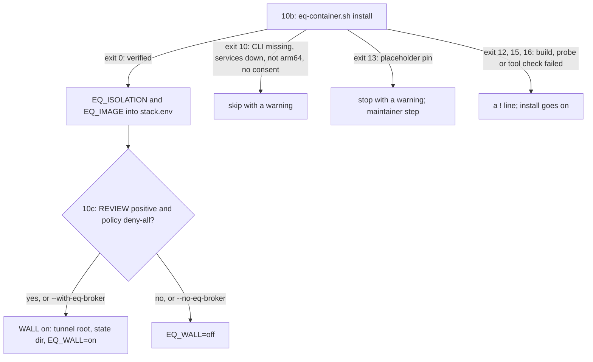

<!-- markdownlint-disable MD013 MD060 -->
# Container backend: eq-container and the WALL

`lib/eq-container` builds and checks the isolation images of the equilibrium harness (the evaluation harness these
images serve; the harness itself is not in this repository). They run with Apple `container` (CLI 1.5.0), where
every container is its own lightweight Linux VM. `lib/eq-wall` is the WALL: a default-deny broker for the few
host actions a container may request, reached through one tunnel directory. Both are opt-in and never fatal to an
install. Apple `container` replaced a Docker backend that never reached `main`; Seatbelt (`sandbox-exec`) and App
Sandbox were rejected (user decision, 2026-10-05).

## The images

| Image class | Contents | Used for |
|---|---|---|
| PF | Lean 4.34.1 + Mathlib v4.34.1 | proof checks |
| CP, CR | CPython 3.14.8 + uv | Python checks |

Every run uses `--network none --read-only --cap-drop ALL --init`, a VM size (`-m`, `-c`), a process-count limit
(`--ulimit nproc`), the unprivileged user 10001, no host environment, only the staged check inputs mounted
read-only and a capped tmpfs `/work`. Oracles, credentials and the home folder are never mounted. Profiles: `core`
(always built, the default) plus opt-in `node rust go julia haskell jvm`.

| File | Role |
|---|---|
| `eq-container.sh` | the driver: `install`, `check`, `status`, `print-env`, `uninstall`; never installs `container` or starts its services |
| `lib.sh` | shared helpers; `eq_require_image` checks that the digest `container image inspect` reports equals the record before every run; `eq_run` is the one place that builds a `container run` |
| `eqc_json.py` | the one reader of the CLI's JSON and of `image save` archives |
| `TOOLS.toml`, `tools.sh`, `verify-tools.sh` | the declarative tool manifest (url, sha256, provenance, allowlists per image class) and its checks |
| `build.sh`, `Dockerfile*`, `minimal/`, `tc/`, `project/` | idempotent builds: full Debian slim, `FROM scratch` minimal images, toolchain extensions, the Lake project |
| `probe.sh`, `probe_inner.sh`, `probe.d/50-tunnel.sh` | the isolation proof and the WALL tunnel probe |

## Installing with `--with-eq-container`

- **10b** runs `bash lib/eq-container/eq-container.sh install` with `--profiles core` (or
  `--eq-container-profiles=LIST`, `STACK_EQ_CONTAINER_PROFILES`, `STACK_EQ_CONTAINER_SET=min|full`). A cold build
  takes 10–40 minutes, several GB of disk, and network for the build only; a rerun with unchanged images builds
  nothing. After exit 0 the installer writes `EQ_ISOLATION=container` and
  `EQ_IMAGE=eq.invalid/<name>:<tag>@sha256:<digest>` into `stack.env` (a value you set stays).
- **Placeholder pins.** Until the maintainer resolves `BUSYBOX_SHA256` in `lib/eq-container/PINS` and the
  bash/perl/jq pins in `TOOLS.toml`, the default `core` profile stops at exit 13 with a warning and the WALL is
  skipped; `STACK_EQ_CONTAINER_SET=full` builds the full Debian image instead.
- **10c, the WALL**, runs only after a verified 10b. It is on by default when `lib/eq-wall/REVIEW` records a
  positive review whose hashes match the shipped broker, client and policy, and `eq_wall.py check-policy`
  reports the default-deny policy. It makes the tunnel root `${XDG_CACHE_HOME:-~/.cache}/claude-agent-stack/eq-tunnel`
  and the state dir `.../claude-agent-stack/eq-wall` (real 0700 directories of yours) and writes `EQ_WALL`,
  `EQ_TUNNEL_DIR`, `EQ_WALL_STATE_DIR` and `EQ_WALL_DIR` into `stack.env`.
- **Your stores stay yours.** The installer never creates or edits `verdicts.jsonl` or `consents.jsonl`; grants
  are made by you with `eq_wall.py verdict-add` / `consent-add` on a terminal.
- **Agents are kept out** of both WALL directories on every install, with or without the flag: Read/Edit deny
  rules, sandbox `denyWrite` for the tunnel root, and the guard's protected paths.

`/stack-doctor` has a section for each ("Container isolation (eq-container)", "WALL (eq-wall)"). `--restore` puts
`stack.env` and the manifest back but leaves the images, eq-container's records and the WALL's state alone and
names them; remove the images with `bash lib/eq-container/eq-container.sh uninstall --yes [--purge]` and the WALL's
directories by hand. Run these scripts from a normal terminal: an agent's sandbox cannot reach the `container`
services.

## The WALL in one paragraph

The WALL's threat model (`lib/eq-wall/WALL_DESIGN.md` §1) treats everything inside the container as the adversary:
model-written code that can write any bytes and file types into its channel directory, race the broker, forge
requests and plant prompt-injection text. Trusted: you, host code whose bytes hash to the frozen configuration,
and your verdict and consent stores. The tunnel is the one read-write bind (a channel directory at `/eq/tunnel`);
every other mount is read-only and the container has no network. Another process of the same host user is out of
scope (a stated residual). Status in that document: built and tested with fakes only.

## Checklist C1–C13: what the real CLI must do

No agent could run the real `container` CLI, so the code's assumptions about it are tested against a fake
(`tests/fake-container/container`). `hand_off/R3_CONTAINER_CHECKLIST.md` lists thirteen commands for you to run
in a normal logged-in terminal (after `container system start`, with `alpine:latest` pulled); each row names
what confirms it and which code depends on it:

| # | Checks |
|---|---|
| C1 | where `container image inspect` puts the image digest |
| C2 | `container system status` exit codes while running and after stop |
| C3 | the row shape of `container list --all --format json` (id, labels) |
| C4 | exit codes of `kill` and `delete --force` on a missing container |
| C5 | the `container image save` archive layout (OCI or docker-save) |
| C6 | `--tmpfs` `size=` and `mode=` sub-options |
| C7 | `--ulimit nproc` enforcement |
| C8 | a container's own exit code, and a CLI error's |
| C9 | stdin with `-i` |
| C10 | `-e` passes only the given variables |
| C11 | `--user 10001:10001` without a passwd entry |
| C12 | an `eq.invalid/` image name fails fast, with no registry pull |
| C13 | `container --version` names 1.5.0 |

Every row stays [unverified] until its command prints what the checklist describes; give any other output to the
owner of the code the row names. (This C10 is the checklist's tenth row, not the [C10 check suite](Testing-and-C10.md).)

Tests: `tests/test_install_eq_container.py` (hermetic installer runs with a stub driver and the fake CLI),
`tests/test_eq_container.py` (the driver and `lib.sh` against the fake CLI), `lib/eq-wall/tests` (102 tests
collected on 2026-10-06; `uv run --no-project --with pytest pytest -q lib/eq-wall/tests`) and
`uv run --script lib/eq-wall/tests/mutations.py`.

Sources: `lib/eq-container/README.md`, `lib/eq-wall/WALL_DESIGN.md` (backend note, status, §1),
`hand_off/R3_CONTAINER_CHECKLIST.md`, `install.sh --help`, `README.md` ("Run the installer", steps 10b and 10c),
`CONFIG.md` §7 "Container isolation and the WALL" and §9 (2026-10-05).
