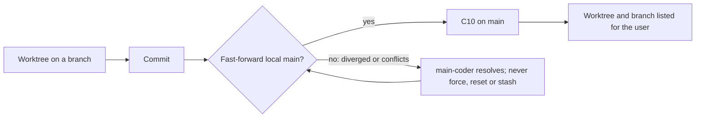

<!-- markdownlint-disable MD013 MD060 -->
# Contributing and workflow

## Change the repository, not the install

`dot-claude/` mirrors `~/.claude/`. Edit the repository, commit, and let `./install.sh` (your step) carry the
change into the config folder. Agents never edit the installed copy: Edit deny rules, the sandbox's `denyWrite`
and the guard's protected paths refuse it.

## Branches, worktrees and merges

The global rules (`dot-claude/rules/claude-agent-stack.md`, "Git") and the decisions recorded in
`hand_off/HANDOFF_STATE.md` §6 set the workflow:

1. **Work on `main`** unless the work needs isolation: another agent editing the same repository, a risky
   experiment, or a branch you asked for. Then use a worktree or a branch, which starts from local `HEAD`.
   Two agents in one repository own disjoint files or use separate worktrees; changes to `agent_guard.py`,
   `settings.json`, `install.sh` and `blackcat.md` are serialised.
2. **Commit, then fast-forward local `main`**: `git -C <main checkout> merge --ff-only <branch>`, or the
   instructor's locked compare-and-swap `just -f tools/instructor/justfile ff-merge --branch <branch>`.
   One integrator per job owns the merge; a child whose brief names another integrator does not merge.
3. **Run C10 on `main`** after every merge ([Testing and C10](Testing-and-C10.md)); `ff-merge` does it for you.
4. **Merge problems go to main-coder.** A fast-forward that fails (diverged history, conflicts, uncommitted
   changes in the main checkout) is never forced, reset, stashed or discarded. Uncommitted changes in the main
   checkout belong to someone else: the user is asked first.
5. **Never push.** No `git push` in any form and no forge write, through any channel; the no-push hook enforces it
   for git, `gh`, `tea` and `fj`. Publishing is your step: agents report the branch and commits.
6. **Worktree cleanup is yours.** The rules' Git section ends a merge with `git worktree remove` and
   `git branch -d`, but the user's later decision (HANDOFF_STATE §6 item 13) is that nobody but the user removes
   worktrees; the orchestrator's prompt follows it and lists worktrees and branches for you instead. See
   [Operations](Operations.md#worktrees-and-branches).



## Reviews: on a trigger, with evidence

- **Self-check first.** A builder runs tests, linters and type checks on what it changed and re-reads its diff
  against the brief before reporting, ending the last check with `date '+%F %R'`.
- **Independent review only when the brief asks or a trigger fires:** a security surface (auth, secrets, crypto,
  untrusted input, network, dependencies, LLM tool use), data loss, concurrency, a public API, schema or CLI
  change, a diff over about 300 lines or 8 files, a numerical or proof core the tests don't pin down, no runnable
  tests, CI, IaC, hooks or permissions, or output to be published. One reviewer per fired trigger class.
- **Security surfaces get both reviewers.** `agent_guard.py`, `settings.json`, `install.sh`, the hooks, the WALL,
  `lib/eq-*`, `doctor.sh` and agents' tool lists get security-auditor and code-reviewer before merge (standing
  constraint, HANDOFF_STATE §6).
- **Evidence-gated round trips.** Work goes back to its author only with concrete evidence: a failing test or
  command with its output, a reproduced bug, a verified discrepancy (`file:line` or a quote against the claim) or
  a required item missing from the brief; never a guess or taste. Nothing verifiably wrong is a PASS. Two
  evidence-backed rounds still failing escalate one tier, or end in `STATUS: partial` with a dossier.

## Gates before a commit

```bash
uv run tests/lint_agents.py
uv run --script tests/prompt_budget.py --check
/usr/bin/python3 dot-claude/hooks/agent_guard.py --self-test
~/.claude/venvs/tools/bin/python -m pytest -q tests/
bash tests/install_smoke.sh                       # from your own terminal
```

## Conventions

- **Record parameters with their reason** in `CONFIG.md`, and add a §9 changelog entry; counts in the README and
  this wiki come from the files, not from memory.
- **Agent permission modes:** an agent that writes files carries `permissionMode: acceptEdits`; a read-only agent
  carries none (or `plan`). Any other value fails `tests/lint_agents.py`.
- **Models:** an agent names `opus` or `sonnet`, never an ID; a specific Claude model ID anywhere in a tracked
  file outside the allowed places fails the lint.
- **Prompt budget:** new agents keep their description ≤ 160 characters and body ≤ 2,400 with the Agent tool
  (≤ 120 and ≤ 1,400 as a leaf); `tests/prompt_budget.py --check` holds the rest against the base revision.
- **Hook code is stdlib-only and runs on Python 3.13**; `bin/stack-tree` and `bin/stack-budget` stay
  3.9-compatible CLI tools.
- **Python through uv**: `uv run`, `uv run --script` for PEP 723 scripts, `uvx`; no bare `python` or `pip`.
- **Local work stays out of git:** personal notes, campaign data and image originals go in `claude-local-work/`;
  agents' scratch stays in `.claude-work/` (both git-ignored).
- **Keep the Claude attribution:** commits made with Claude Code end with a `Co-Authored-By: Claude …` trailer.
- **This wiki:** pages live in `docs/wiki/`; `tests/test_wiki_links.py` checks links, anchors, images and the
  sidebar. When a count changes, update it from the command the page names.

Licence: Apache-2.0 for code, docs and prompts (`LICENSE`, `NOTICE`); the images in `assets/` are CC BY 4.0.

Sources: `dot-claude/rules/claude-agent-stack.md` ("Git", "Self-check and review", "Tools"),
`dot-claude/agents/orchestrator.md` (step 8), `hand_off/HANDOFF_STATE.md` §6, `README.md` ("Contributing and
safety", "Prompt budget"), `CONFIG.md` §5 "Permission modes".
