<!-- markdownlint-disable MD013 MD060 -->
# Getting started: install, update, restore

`./install.sh` copies the stack from the repository's `dot-claude/` into your Claude Code config folder and sets up
the tools it needs. **Only you run it.** The guard refuses `install.sh` to every agent and to the main thread,
except `--help`, `--dry-run`, `--print-managed-settings`, `--diff` and scratch installs (a temporary `HOME` and
`CLAUDE_CONFIG_DIR`), so installing stays a deliberate step from your own terminal.

## Requirements

| Requirement | What the stack expects |
|---|---|
| macOS | required; the installer stops on any other system (`STACK_ALLOW_NON_MACOS=1` exists for the tests only) |
| Apple Silicon | required in practice: the sci and tools venvs are hash-locked for arm64 wheels; Intel is untested |
| Xcode Command Line Tools | `git` and a `python3` ≥ 3.8 that runs (the installer starts on it) |
| Claude Code | ≥ 2.1.271 (`MIN_CLAUDE` in `install.sh`; older warns) |
| uv, Node.js ≥ 22.5 with `npx` | installed by step 2 when missing |
| A Claude account with Claude Code access | required |

Optional toolchains, keys and macOS permissions are listed in the README's "Requirements (macOS only)".
`JINA_API_KEY` is effectively required (web reading and libdocs); the other keys are optional.

## First install

Run this from a terminal with no Claude Code session open, in a checkout on the `main` branch:

```bash
git clone <repository-url> claude-agent-stack && cd claude-agent-stack
./install.sh --dry-run            # the plan: added / replaced / removed, each with a reason
./install.sh                      # core install; one backup of everything it changes or removes
$EDITOR ~/.claude/stack.env       # keys: read at connect time; Claude model IDs: re-run ./install.sh
```

> **Read the dry run first when `~/.claude` already exists.** Every run prunes, with no opt-out: stack files you
> edited, and files of yours named like the stack's, are moved into the backup and replaced. Agents and skills of
> yours under other names stay. `--restore` brings everything back.

Then quit every Claude Code session (terminal, Desktop, IDEs), start `claude` (it starts as BlackCat, in Plan
mode), run `/effort medium` once and `/stack-doctor`. Healthy means 0 FAIL; WARN lines name optional pieces.

A real run started on another branch fast-forwards `main` and re-runs itself (it never pushes); a dirty tree or
diverged history stops it. On a terminal the installer asks before it acts: about a non-default config folder,
about the stack's diff since the last install, and about the open-file limit LaunchDaemon (sudo runs only after
`y`).

## What a run does

The run prints eleven steps; with `--with-eq-container`, steps 10b and 10c run between 10 and 11.

```mermaid
flowchart LR
  accTitle: The installer's steps
  accDescr: Prerequisites, tools, optional ML and Adobe steps, then stage, render, validate and apply, followed by MCP, plugins, optional container steps and the shell profile.
  S1["1 Prerequisites"] --> S2["2 Tools and venvs"] --> S3["3 ML venv (--with-ml)"] --> S4["4 Adobe (--with-adobe)"]
  S4 --> S5["5 Stage"] --> S6["6 Render"] --> S7["7 Validate, back up, apply"]
  S7 --> S8["8 MCP prefetch"] --> S9["9 User-scope MCP"] --> S10["10 Plugins and LSP"]
  S10 --> S10b["10b/10c container images and WALL (opt-in)"] --> S11["11 Shell profile"]
```



| Step | What happens |
|---|---|
| 1 Prerequisites | macOS, git, python3, Claude Code version, the hooks' interpreter path; the target banner and question; the stack's diff since the last install (asked on a terminal); the open-file limit offer |
| 2 Tools | `lib/devtools.sh`: Homebrew, one brew batch per type, uv, nvm, rustup, ghcup, juliaup, coursier, elan and the dev tools, each skipped when already present from any source; magg, huetension, the hash-locked `sci` and `tools` venvs |
| 3 ML venv | `--with-ml` only: `~/.claude/venvs/ml` (several GB) |
| 4 Adobe | `--with-adobe` only: the After Effects MCP at a pinned commit and the Premiere connector |
| 5 Stage | the stack's part of the config dir is copied to a private staging dir |
| 6 Render | agents, rules, skills, scripts, `settings.json` and the [`CLAUDE.md` block](CLAUDE-md-Block.md) |
| 7 Merge, validate, apply | JSON, frontmatter, placeholders and the staged guard's `--self-test`; the plan; one backup; apply; then `tests/lint_agents.py` (warns only) |
| 8 MCP prefetch | dependencies of the local MCP servers into the private `STACK_CACHE` |
| 9 User-scope MCP | exa, jina, wolfram, huggingface, and wandb when its key exists; keys come through `bin/mcp-headers` |
| 10 Plugins | document-skills, LSP plugins for the servers found, Anthropic's skill plugins (mcp-server-dev, session-report, skill-creator, math-olympiad) |
| 10b, 10c | `--with-eq-container` only: [container images and the WALL](Container-Backend.md) |
| 11 Shell profile | one line in `~/.zshrc` (and `~/.bashrc` if present) and the `claude-ninja` launcher link in `~/.local/bin` |

Before step 7 writes `settings.json`, the run links `bin/stack-python` to uv's managed Python 3.13 and smoke-tests
the hook launcher on it: a Read through the fail-closed guard must pass and a `git push` must be denied. A failure
stops the run with your previous hooks in place.

## Options

`./install.sh --help` prints them all. The ones you will use:

| Option | Effect |
|---|---|
| `--dry-run` | prints every change (files, removals, MCP, plugins, rc) and makes none |
| `--diff` | lists what separates this checkout's `dot-claude/` from the installed folder; writes nothing, runs from any branch; takes only `--config-dir` |
| `--restore [DIR]` | puts the config dir back as it was before an install (default: the latest backup); add `--force` to restore saved symlinks that point outside the config dir |
| `--yes`, `-y` | installs a changed stack without asking (needed without a terminal) and skips the target question |
| `--no-prompt` | never asks; a changed stack then stops unless `--yes` is given |
| `--config-dir PATH` | installs into PATH instead of `~/.claude` (precedence: `--config-dir` > `CLAUDE_CONFIG_DIR` > `~/.claude`) |
| `--with-ml`, `--with-lsp`, `--with-adobe` | the ML venv; missing language servers; the Adobe MCP servers |
| `--with-eq-container` | the container isolation images and, by default, the WALL ([Container backend](Container-Backend.md)) |
| `--no-mcp`, `--no-plugins`, `--no-anthropic-plugins`, `--keep-plugin-duplicates`, `--replace-mcp` | MCP and plugin steps |
| `--no-deps`, `--no-profile`, `--write-through-links` | skip tool installs; leave the shell rc alone; write through a symlinked `agents/` or `skills/` |
| `--print-managed-settings`, `--mcp-plan` | print an optional managed-settings file; print the MCP plan; neither changes anything |

`--no-prune` and `--force` without `--restore` are usage errors (exit 2): pruning is always on.

## Dry run, diff and the change question

- **`--dry-run`** shows the plan (`changes: N added, N updated, N removed`, then `replaced:` and `removed:`, each
  with a reason) and stops before the backup.
- **`--diff`** compares repo and install area by area (agents, rules, skills, hooks, `bin/`, `mcp/`, hook wiring,
  magg entries, the `CLAUDE.md` block): `+` repo only, `-` installed only, `~` differs. It renders the repo the
  way the installer would, so a fresh install diffs clean.
- **The change question.** The manifest records the stack commit each install shipped. The next run prints the
  diffstat of everything shipped since then and asks
  `The stack changed since the last install (listed above). Install it? ... [y/N]`. With no terminal at all a
  changed stack stops with exit 1 unless `--yes` is given.

## Backups, restore and the manifest

Every run that changes something saves what it changes or removes into one backup,
`${XDG_STATE_HOME:-~/.local/state}/claude-agent-stack-backups/<timestamp>-<random>/` (0700, files 0600), and prints
the restore command. A run that changes nothing makes no backup, and none is ever deleted (past ten backups of
one config dir the run only says so). Agents cannot read the backups: Read/Edit deny rules, the sandbox and a
guard protected path keep them out.

```bash
./install.sh --restore --dry-run          # what a restore would do
./install.sh --restore                    # undo the latest install
./install.sh --restore <backup-dir>       # undo a given one
```

A restore is a staged plan too: it backs up the current state first and prints how to undo itself.

`.stack-manifest.json` in the config dir lists every stack file as relative path plus sha256, and records the
stack commit of the install, the `CLAUDE.md` block's hash, the plugins installed or missing, and (with
`--with-eq-container`) the container and WALL state. Pruning uses it: of the files the stack no longer ships, only
those it installed and nobody edited are removed.

## Update and uninstall

```bash
git pull --ff-only                # in your checkout, on main
./install.sh --dry-run            # what changes, each with a reason
./install.sh                      # lists the stack's diff since the last install and asks first
```

Then quit every Claude Code session and start new ones. Your `stack.env` is kept; new variables are appended
commented out. An install older than commit `4286278` (2026-10-04) must upgrade through that commit first; the
README's "Update" section has the throwaway-clone commands.

Uninstall: `./install.sh --restore <the first install's backup>`, delete the line ending in
`# claude-agent-stack` from your shell rc, and `claude mcp remove -s user exa` (and `jina`, `wolfram`,
`huggingface`, `wandb`).

## Verify

```bash
bash ~/.claude/bin/doctor.sh                                   # installed health check (= /stack-doctor)
~/.claude/bin/stack-python dot-claude/hooks/agent_guard.py --self-test
uv run tests/lint_agents.py
uv run --script tests/prompt_budget.py --check
~/.claude/venvs/tools/bin/python -m pytest -q tests/
bash tests/install_smoke.sh                                    # hermetic installer runs; from your own terminal
```

Sources: `install.sh --help`, `README.md` ("Requirements", "Install", "Verify", "Update", "Backup, restore and
uninstall"), `CONFIG.md` §7 ("How an install runs", "Hook interpreter", "Install target", "Pruning", "Repo vs
install", "Backups and `--restore`", "Supply chain").
