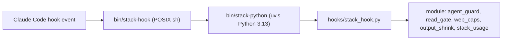

<!-- markdownlint-disable MD013 MD060 -->
# Hooks and the guard

The stack's limits are enforced by Claude Code hooks, mostly by one policy hook, `dot-claude/hooks/agent_guard.py`
(stdlib Python). Prompts ask agents to behave; the hooks refuse what they must not do. This page lists what runs
where, what each hook enforces, and what is only observed.

## How a hook starts

Every Python hook in `settings.json` runs `/bin/sh "<config>/bin/stack-hook" [--fail-closed] <module> [mode]`.

- `bin/stack-hook` finds the interpreter without starting Python: `$STACK_PYTHON`, then `<config>/bin/stack-python`
  (the installer's link to uv's managed Python 3.13), then `uv python find ... 3.13`; never a project venv.
- **Fail closed on the guard's PreToolUse entries** (main, `no-push`, `image-limit`, `budget`, `blackcat-guard`):
  an exception in a handler, or a hook that cannot start, denies the call with a message naming `./install.sh`.
  `read_gate`, `web_caps` and `output_shrink` fail open by design, and so do the token budgets when a transcript
  cannot be read.
- **Recovery:** run `./install.sh` from the stack repo; it repairs the link and the bytecode. `STACK_POLICY=off`
  lets the fail-closed entries through while the hook cannot start, except `agent_guard no-push`, which is never
  lifted.

## Wiring

| Event | Matcher | Hook (module and mode) |
|---|---|---|
| SessionStart | `startup\|resume\|clear\|compact\|fork` | `agent_guard` (state reset, compaction digest) |
| SessionStart | any | `agent_guard session-env` (the sandboxed Bash environment) |
| UserPromptSubmit | any | `agent_guard` (starts the prompt's token budget) |
| UserPromptExpansion | `override-agent`, `stack-doctor`, `stack-tree` | `agent_guard override-agent`; `bin/doctor.sh --hook`; `bin/stack-tree --hook` (answer the user commands without a model turn) |
| PreToolUse | `Agent\|Task\|SubAgent\|Workflow\|RunWorkflow`, `SendMessage` | `agent_guard` (spawn policy, fan-out, messages), fail-closed |
| PreToolUse | `Bash\|Monitor\|PowerShell` | `agent_guard no-push`, fail-closed |
| PreToolUse | `mcp__computer-use__.*`; local-file MCP tools; `mcp__neural-memory__nmem_remember` | `agent_guard` (one agent on the screen; MCP path arguments held to the Read deny rules; web taint), fail-closed |
| PreToolUse | `mcp__.*` | `agent_guard image-limit`, fail-closed |
| PreToolUse | `^mcp__(exa\|jina\|spider)__` | `web_caps` |
| PreToolUse | `Read\|Grep\|Glob\|Bash` | `read_gate` |
| PreToolUse | `*` | `agent_guard blackcat-guard --settings` and `agent_guard budget`, both fail-closed |
| PostToolUse | `Agent\|Task\|SubAgent\|TaskStop`; `Read\|mcp__.*`; `Bash\|Read` | `agent_guard`; `agent_guard image-limit`; `output_shrink` |
| SubagentStart | any | `agent_guard`; `stack_usage start` |
| SubagentStop, StopFailure, PostToolUseFailure, PermissionDenied, PermissionRequest, PreCompact | (as wired) | `agent_guard` |
| SessionEnd | any | `stack_usage end` |

BlackCat's own file adds two hooks that run only in a BlackCat session: PreToolUse `*` →
`agent_guard blackcat-guard` (fail-closed) and Stop → `agent_guard blackcat-reply` (log only). The status line
runs `bin/statusline.py`.

## What the guard enforces

| Guard | Enforces | Lifted by `STACK_POLICY=off`? | Tests |
|---|---|---|---|
| Spawn allowlist | `subagent_type` must be a stack agent in the caller's `POLICY` row; generic, built-in, missing and unknown types refused; a generic agent started outside the Agent tool has every tool call refused | yes | `tests/test_agent_guard.py`, `tests/lint_agents.py` |
| Fan-out | running children per agent (3 by default; see [Architecture](Architecture.md#layers-depth-and-fan-out)) | yes | `tests/test_agent_guard.py`, `tests/test_guard_regressions.py` |
| BlackCat delegate-only | tool allowlist, no Bash/Write/Edit, ≤ 3 Read per prompt | no (only `STACK_BLACKCAT_DELEGATE_ONLY=0`) | `tests/test_blackcat_tools.py`, `tests/test_agent_guard.py` |
| BlackCat step cap | 24 tool calls per prompt, dispatches within 120 s | yes | `tests/test_agent_guard.py` |
| No push | `git push` in any form and forge writes (`gh`/`tea`/`fj`, `gh api`, curl/wget/httpie to forge hosts), also inside `bash -c`, `eval`, `$(...)` | **never** | `tests/test_no_push.py` |
| Protected paths | Bash writes, deletes and renames of the installed stack, the backups, the hook state and `tools/instructor`, on top of the Edit/Write deny rules | **never** | `tests/test_protected_paths.py` |
| Installer rule | no `install.sh` run except `--help`, `--dry-run`, `--print-managed-settings`, `--diff` and scratch installs; only toolsmith runs `bin/stack-install`, and toolsmith runs nothing else | **never** | `tests/test_guard_round2.py`, `tests/test_toolsmith.py` |
| Credential reads | `gh auth token`, `git credential fill`, keychain dumps and similar refused | **never** | `tests/test_guard_round2.py` |
| Index blinding | `git update-index --assume-unchanged`/`--skip-worktree`, sparse checkout and `core.ignoreStat` refused | **never** | `tests/test_no_push.py` |
| Read-only agents | code-reviewer, security-auditor, verifier, plan-reviewer, claude-code-guide and proof-checker run only read-only Bash; their scratch code is content-checked | yes | `tests/test_readonly_agents.py` |
| Hard token budgets | context tokens per human prompt and per session, whole tree (seeds 100,000,000 and 1,920,000,000); past them every call but reporting is refused | yes | `tests/test_limits_guard.py`, `tests/test_stack_limits.py` |
| Turn gate, MCP cap | API calls per subagent run (`turns.<type>`); 64 MCP calls per subagent per prompt | yes | `tests/test_limits_guard.py` |
| Web taint | an agent that read web content, or is linked to one that did, cannot write neural-memory | yes | `tests/test_guard_round2.py`, `tests/test_guard_round3.py` |
| Image limit | images an agent sees or uploads stay ≤ 1919 px per side (`STACK_IMAGE_MAX_PX`) | yes | `tests/test_image_limit.py` |
| Screen lock | one agent on computer-use at a time | yes | `tests/test_agent_guard.py` |

"Never" means the refusal sits in the no-push hook, which `STACK_POLICY=off` does not switch off. The shell
parsing behind these rules is a heuristic: script files, aliases and text assembled at run time can hide a
command, which is why the sandbox is meant to be the boundary ([Security model](Security-Model.md)).

## What is only observed

These ship passive. Each logs to the session's state folder (or the project's `.claude-work/`) and changes no
decision until you switch it.

| Mechanism | Default | What it records | Switch |
|---|---|---|---|
| Soft token limits | on (warning only) | past a per-type limit, the next tool call carries one wrap-up warning; nothing is refused | `STACK_SOFT_LIMIT_SCALE` (`0` = off) |
| Hand-back check (`stack_report.py`) | `observe` | each final report's status, size and checks in `usage/reports.jsonl` and `reports/` | `STACK_REPORT_FORMAT=compact\|json\|off` |
| Brief budgets and early stop (`stack_progress.py`) | `observe` | the brief's `budget:` line reached, stalls, `stop`, `recovered`, `first_write` in `early-stop.jsonl` | `STACK_EARLY_STOP=warn\|off` |
| Output shrink (`output_shrink.py`) | `shadow` | what it would cut from a large Bash or Read result, in `.claude-work/output-shrink/log.jsonl` | `STACK_OUTPUT_SHRINK=on\|off` |
| Credential scrub | `observe` | counts of credential-looking patterns in briefs and messages (never text) | `STACK_SCRUB=off` |
| Session slots, dynamic fan-out | `shadow` | spawn decisions against `CLAUDE_CODE_MAX_CONCURRENT_SUBAGENTS` and the orchestrator's plan | `STACK_FANOUT_SESSION`, `STACK_FANOUT_DYN` (`enforce`) |
| BlackCat reply check | on | a BlackCat turn that ends without text, in `reply-check.jsonl` | — |

## The other hooks

- **Read gate** (`read_gate.py`): the first read of build output, dependencies, large data, media or binaries is
  refused with a cheaper alternative; the identical retry passes, so a necessary read is the agent's explicit
  second call. Some agents are exempt per category (`READ_GATE_EXEMPT_*` in `stack.env`); `READ_GATE=0` turns it
  off. Never gated: `.claude-work/`, Read with `limit` ≤ 200, and readers whose output is capped (`head`, `wc`, …).
- **Web caps** (`web_caps.py`): per-call result, character and crawl-depth caps on every exa, jina and spider call;
  refuses spider `cron`, `webhooks` and `run_in_background`. The caps are `EXA_MAX_*`, `JINA_MAX_*` and
  `SPIDER_*` in `stack.env`.
- **Output shrink** (`output_shrink.py`): in `on` mode, keeps a large result's decisive lines (errors first) and
  spills the full output, credentials masked, to a 0600 file under `.claude-work/output-shrink/spill/`; prompt
  files (`SKILL.md`, `CLAUDE.md`, agent and rules files) are never shrunk.
- **Brief budgets** (`stack_progress.py`): called by the guard's budget gate after every hard budget allowed a
  subagent's call, so tokens are never counted twice.
- **Toolsmith policy** (`toolsmith_policy.py`): the installer grammar, argv, environment and vetting rules,
  shared by the guard and `bin/stack-install` ([Toolsmith](Toolsmith.md)).
- **Usage collector** (`stack_usage.py`): one background collector per session writes per-segment rows
  (numbers, ids and a few plain words of the task; no prompt or transcript text) to `usage/runs3.csv`;
  `stack_sched_refresh.py` refits the scheduler's cost model when it exits.
- **Learned limits** (`stack_limits.py`): freezes one snapshot of turn and token limits per session from the
  collector's data, inside repo floors and ceilings; fan-out, depth and the MCP cap never learn.

## Knobs

The knob table, with defaults, reasons and which ones the installer owns, is `CONFIG.md` §5 (40 rows). The ones
most often changed: `ANTHROPIC_DEFAULT_OPUS_MODEL` / `_SONNET_MODEL` in `stack.env`, `STACK_MAX_FANOUT(_BY_TYPE)`,
`BLACKCAT_MAX_*`, the context budgets, `STACK_SOFT_LIMIT_SCALE`, `READ_GATE`, `STACK_POLICY`,
`autoCompactWindow` and `permissions.defaultMode`. `STACK_POLICY=off` lifts the spawn, budget, lock and read-only
guards; it never lifts the no-push hook's refusals or BlackCat's delegate-only gate.

## Commands

| Command | Does |
|---|---|
| `agent_guard.py --self-test` | the guard's own checks (also run by the installer on the staged copy) |
| `agent_guard.py --print-policy` | the spawn table as JSON (read by `doctor.sh` and `tests/lint_agents.py`) |
| `agent_guard.py delegations [session] [--json]` | the delegation ledger |
| `read_gate.py --print`, `--self-test` | effective read-gate values; its tests |
| `output_shrink.py report` | the shadow log's evidence for switching to `on` |
| `stack_progress.py report` | early-stop signals joined with hand-back status |
| `stack_limits.py show`, `history`, `hold`, `freeze`, `rollback`, `propose` | inspect or pin the learned limits (your terminal) |

Sources: `dot-claude/settings.json` (`hooks`), `dot-claude/agents/blackcat.md` (frontmatter hooks),
`agent_guard.py` module docstring (events, state, failure policy, knobs), `README.md` ("Hooks at a glance",
"Safety and guardrails", "Guard hooks", "Cost and context control"), `CONFIG.md` §5 ("Soft token limits",
"Brief budgets and early stop", "Read gate", "Output shrink", "Message protocol") and §7 ("Hook interpreter",
"Supply chain").
