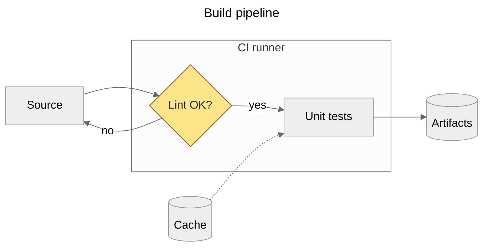
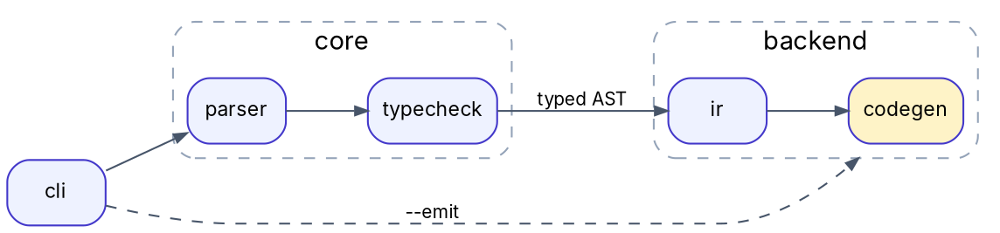

# Diagrams as code

## Scope
- Structural diagrams kept as text: flowcharts, sequence/state/class/ER, architecture, dependency graphs,
  commutative and string diagrams. Data plots are out of scope (`data-visualization`); hand-drawn inline-SVG diagrams inside Artifacts → the built-in `artifact-diagramming` skill. What a categorical
  diagram asserts is `category-theory`; LaTeX documents and builds are `latex-typesetting`; SVG cleanup is
  `svg-vector-craft`; site/Pandoc pipelines are `markdown-publishing`.
- Checked Sep 2026: Mermaid and mermaid-cli 12.0, Graphviz 16.1, D2 0.9.0, PlantUML 1.2026.8, TeX Live
  (tikz-cd, quiver.sty 1.7), dvisvgm 3, poppler 26. Every snippet below was rendered.

## 1. Choose the tool
| Need | Tool | Strengths / limits |
|---|---|---|
| Flowchart, sequence, class, state, ER, gantt, mindmap, timeline inside Markdown on GitHub/GitLab | Mermaid | renders natively on the forge; little layout control (no pinning), clutter beyond ~30–50 nodes, `maxTextSize` 50 000 chars and `maxEdges` 500 by default, renderer version skew |
| Large or dense graphs, dependency/call graphs, generated from code | Graphviz DOT (`dot`; `neato`/`fdp`/`sfdp` force-directed, `circo`, `twopi`) | best hierarchical layout, ranks and clusters, scriptable; verbose styling |
| Architecture diagrams, containers, icons, good defaults | D2 | layouts dagre (default), ELK, TALA (open source and bundled since 0.9); SVG/PNG/PDF/PPTX/GIF; LaTeX and Markdown labels |
| UML-heavy documentation, C4, Java shops | PlantUML | widest UML coverage; Smetana layout needs no Graphviz; GitLab.com renders it |
| Commutative diagrams, diagrams in papers | tikz-cd; draw in quiver (q.uiver.app) and export | typographically matches the paper; needs TeX |
| String diagrams (monoidal categories, ZX, circuits) | TikZ by hand, or TikZiT (GUI; `.tikz` + `.tikzstyles`) | exact positions; semantics in `category-theory` |
| Whiteboard or hand-drawn look | Excalidraw (`.excalidraw` JSON); from code: D2 `--sketch`, Mermaid `look: handDrawn` | Excalidraw diffs only as JSON |
| One HTTP API for many languages | Kroki (Mermaid, PlantUML, D2, Graphviz, TikZ, Excalidraw, BPMN, Vega, WaveDrom…) | public kroki.io receives the source: self-host (Docker) for private material |

## 2. Mermaid
- Mermaid 12 bundles ELK and makes it the default layout, and switches flowchart, class, ER, sequence, state
  (and others) to the `redux-color` theme and `neo` look; set `theme: default` and `look: classic` to keep
  the old appearance. It needs Node ≥ 22.12 / Safari 17.4+. GitLab documents Mermaid 11; on GitHub a block
  containing only `info` prints the deployed version. Pin `layout` when the same source renders in several places.
- Front-matter `config:` replaces the older `%%{init: …}%%` directives. Use `flowchart` (not `graph`).

```text
sequenceDiagram                 stateDiagram-v2              erDiagram
  autonumber                      [*] --> Idle                 AUTHOR ||--o{ POST : writes
  participant C as Client         Idle --> Running: start      POST }o--o{ TAG : tagged
  C->>+S: GET /items              Running --> Idle: stop
  S-->>-C: 200 OK                 Running --> [*]: crash
  Note over C,S: TLS at the edge
```
- Labels with punctuation go in quotes (`A["f(x) → y"]`); `%%` starts a comment; a node id `end` in lowercase
  breaks flowcharts (use `End` or another id); math in labels as `"$$x^2$$"` (KaTeX).
- Render with mermaid-cli (`brew install mermaid-cli`, or `npx -p @mermaid-js/mermaid-cli mmdc`):
```sh
mmdc -i flow.mmd -o flow.svg -b transparent
mmdc -i flow.mmd -o flow.png -s 3 -b white            # raster at 3x device scale
mmdc -i flow.mmd -o flow.pdf                          # v12: PDF fits the diagram; --pdf-paper-format A4 for a page
mmdc -i notes.md -o notes.out.md                      # renders every mermaid block, rewrites the Markdown
mmdc -i flow.mmd -o flow.svg -c mermaid.json -C extra.css -p puppeteer.json
```
  v12 replaced `-w/-H` with `--size`, dropped `-f/--pdfFit` (fitting is the default), added `-j/--jobs` and
  `--no-font-embed`. mmdc drives headless Chrome through Puppeteer: "Could not find Chrome" → run
  `npx puppeteer browsers install chrome-headless-shell` or pass `-p` with `{"executablePath": "…"}`;
  as root or in containers add `"args": ["--no-sandbox"]`.
- mmdc SVG uses CSS and `<foreignObject>` HTML labels: fine in browsers, broken in Inkscape/Illustrator and
  SVG→PDF converters (labels vanish, fills go black; `htmlLabels: false` only partly helps). For print or
  vector editing: `mmdc -o flow.pdf`, then `pdftocairo -svg flow.pdf flow.svg` (no CSS, text as paths).

## 3. Graphviz (DOT)

```sh
dot -Tsvg deps.dot -o deps.svg; dot -Tpdf deps.dot -o deps.pdf; dot -Tpng -Gdpi=200 deps.dot -o deps.png
dot -Tsvg:cairo deps.dot -o deps_paths.svg                         # glyphs as paths: portable, not selectable
dot -Kneato -Goverlap=false -Gsplines=true -Tsvg net.dot -o net.svg   # undirected/force; sfdp for thousands of nodes
```
- Clusters need the `cluster_` prefix; `compound=true` plus `lhead`/`ltail` points an edge at a cluster.
- A top-level `{rank=same; a; b}` that names clustered nodes pulls them out of their cluster ("cluster named …
  not found"); put rank constraints inside the cluster. With `splines=ortho` use `xlabel` for edge labels.
- Node sizes come from font metrics where `dot` runs: install the named font there, or ship PDF /
  `-Tsvg:cairo`. Generate DOT from scripts as plain text; networkx `write_dot` needs pydot or pygraphviz.

## 4. D2
```d2
direction: right
vars: {d2-config: {layout-engine: elk; theme-id: 0; pad: 20}}
classes: {svc: {style: {border-radius: 6; fill: "#eef2ff"; stroke: "#4338ca"}}}
user: User {shape: person}
cloud: Cloud {
  api: API gateway {class: svc}
  worker: Worker {class: svc}
  db: Postgres {shape: cylinder}
  api -> worker: enqueue
  worker -> db: write
}
user -> cloud.api: HTTPS
cloud.worker -> cloud.api: status {style.stroke-dash: 4}
formula: |latex
  \sum_{i=1}^n x_i = \frac{n(n+1)}{2}
|
cloud.db -> formula
```
```sh
d2 fmt arch.d2 && d2 validate arch.d2
d2 --layout=tala arch.d2 arch.svg          # dagre (default), elk, tala; flags override vars.d2-config
d2 arch.d2 arch.png; d2 arch.d2 arch.pdf  # built-in renderer since 0.9 (older versions downloaded Playwright)
d2 --sketch --theme=0 arch.d2 sketch.svg; d2 --watch arch.d2 arch.svg   # hand-drawn look; live preview
```
- Block strings are raw: single backslashes in `|latex …|` (a `\\` becomes a TeX line break); `|md …|` for
  Markdown labels. SVG output embeds its fonts (Source Sans Pro unless `--font-regular` etc. point to TTFs).
- `--dark-theme ID` adds a prefers-color-scheme variant; `layers`/`scenarios`/`steps` build multi-board
  diagrams. Source moved to github.com/d2lang/d2; `brew install d2` on macOS.

## 5. PlantUML
```text
@startuml
!pragma layout smetana
actor User
participant API
database DB
User -> API: POST /jobs
activate API
API -> DB: INSERT job
API --> User: 202 Accepted
deactivate API
@enduml
```
`plantuml -tsvg seq.puml` (Homebrew wrapper) or `java -jar plantuml.jar -tsvg seq.puml`; also `-tpng`, `-tpdf`.
`!pragma layout smetana` uses the built-in Java port of dot; otherwise class/component layouts need
Graphviz (`-testdot` checks it).

## 6. TikZ: tikz-cd, quiver, string diagrams
```latex
\documentclass[border=2pt]{standalone}
\usepackage{amssymb,tikz-cd}              % amssymb for \lrcorner
\begin{document}
\begin{tikzcd}[column sep=large, row sep=large]
  X \arrow[drr, bend left, "f"] \arrow[ddr, bend right, "g"'] \arrow[dr, dashed, "\exists!\,u" description] & & \\
  & P \arrow[r, "p_2"] \arrow[d, "p_1"'] \arrow[dr, phantom, "\lrcorner", very near start] & B \arrow[d, "k"] \\
  & A \arrow[r, "h"'] & C
\end{tikzcd}
\qquad
\begin{tikzcd}[column sep=huge]           % 2-cell: name the arrows' midpoints, then connect them
  \mathcal{C} \arrow[r, bend left=50, "F", ""{name=U, below}] \arrow[r, bend right=50, "G"', ""{name=D}]
  & \mathcal{D} \arrow[Rightarrow, from=U, to=D, "\alpha"]
\end{tikzcd}
\end{document}
```
- Arrow vocabulary: direction letters `r l u d` combined (`drr`); `"f"` label left of travel, `"f"'` swapped,
  `description` on the arrow; `hook`, `two heads`, `tail`, `maps to`, `equal`, `dash`, `dashed`, `squiggly`
  (needs `\usetikzlibrary{decorations.pathmorphing}`), `Rightarrow`, `shift left`/`shift right` for parallel
  arrows, `bend left=40`, `crossing over` (cube faces), `phantom` for corners and `\cong` labels, `near start`,
  `shorten <=2pt, shorten >=2pt`. `\ar` abbreviates `\arrow`.
- Inside macro arguments or beamer frames: `\begin{tikzcd}[ampersand replacement=\&]` and `\&` between
  cells; otherwise "Single ampersand used with wrong catcode".
- quiver (q.uiver.app): draw, then export LaTeX: tikz-cd code addressed by `from=row-col, to=row-col` plus a
  comment URL that reopens the diagram for editing. Curved (`curve={height=…}`), shortened and 2-tail styles
  need `\usepackage{quiver}` (quiver.sty is on CTAN and in TeX Live).
- String diagrams in plain TikZ (read top to bottom here: $g\circ f : A\otimes B \to D$; state the convention):
```latex
\documentclass[tikz,border=2pt]{standalone}
\begin{document}
\begin{tikzpicture}[box/.style={draw, fill=white, minimum width=14mm, minimum height=7mm}, wire/.style={thick}]
  \node[box] (f) at (0,0) {$f$};  \node[box] (g) at (0,-1.6) {$g$};
  \draw[wire] ([xshift=-3mm]f.north) -- ++(0,0.8) node[above] {$A$};
  \draw[wire] ([xshift=3mm]f.north) -- ++(0,0.8) node[above] {$B$};
  \draw[wire] (f.south) -- node[right] {$C$} (g.north);
  \draw[wire] (g.south) -- ++(0,-0.8) node[below] {$D$};
\end{tikzpicture}
\end{document}
```
  TikZiT edits such figures graphically: `\usepackage{tikzit}`, `\input{styles.tikzstyles}`, then
  `\tikzfig{figures/fig1}` (inline) or `\ctikzfig{…}` (centered).
- Render and convert:
```sh
latexmk -lualatex cd.tex                            # standalone under LuaLaTeX needs luatex85.sty (full TeX Live/MacTeX)
tectonic -X compile cd.tex                          # XeTeX-based; fetches packages on first use
pdftocairo -svg cd.pdf cd.svg                       # glyphs as paths: renders the same everywhere (also pdf2svg)
dvisvgm --pdf --font-format=woff2 -o cd.svg cd.pdf  # selectable text with embedded WOFF2 fonts, smaller file
pdftocairo -png -r 300 -singlefile cd.pdf cd        # writes cd.png
# DVI route (no PDF step): \documentclass[dvisvgm,border=2pt]{standalone}, then
latexmk -dvi cd.tex && dvisvgm --font-format=woff2 --exact-bbox -o cd.svg cd.dvi
```
  dvisvgm's default `--font-format=svg` writes SVG fonts, which Chrome and Firefox ignore (math italic and
  calligraphic letters fall back to a plain serif); use `woff2`, or `--no-fonts` for paths.

## 7. Excalidraw
Keep `.excalidraw` (JSON) in the repo; export PNG/SVG with "Embed scene" so the image reopens editable (the
VS Code extension edits `*.excalidraw.svg`/`.png` directly). Mermaid can be converted into an editable
Excalidraw scene (`@excalidraw/mermaid-to-excalidraw`, also built into the app). MIT-licensed.

## 8. Embedding
| Target | How |
|---|---|
| GitHub Markdown | ```` ```mermaid ```` fences (also geojson, topojson, stl); other tools: commit source and SVG side by side |
| GitLab | ```` ```mermaid ````; ```` ```plantuml ```` on GitLab.com (self-managed: admin enables); Kroki fences if the instance enables Kroki |
| Astro or other unified sites | build time: `rehype-mermaid` (strategies `inline-svg` default, `img-svg`, `img-png`, `pre-mermaid`; `dark: true` for a color-scheme `<picture>`; needs Playwright + Chromium); exclude `mermaid` from Shiki. Details: `markdown-publishing` |
| MkDocs Material | `pymdownx.superfences` custom fence: `name: mermaid`, `class: mermaid`, `format: !!python/name:pymdownx.superfences.fence_code_format` |
| Docusaurus | `@docusaurus/theme-mermaid` with `markdown: {mermaid: true}` |
| LaTeX, Word, slides | pre-rendered PDF/SVG (vector) or PNG at ≥ 2× display size |

Prefer build-time rendering (no client JS, no layout drift when a renderer updates). Keep `name.mmd` next to
`name.svg` and regenerate from a Makefile or CI step.

## 9. Readable diagrams
- One question per diagram; beyond ~15–20 nodes split it or cluster (heuristic).
- One primary direction: LR for pipelines and time, TB for hierarchies. Reorder declarations to remove crossings.
- One shape per kind of thing; add a legend when more than three kinds or more than one line style appear.
- Arrows mean one thing per diagram (data flow, dependency or control); variants (dashed = async/optional) go in the legend.
- Nodes are short nouns, edges verbs; sentence case; no undefined abbreviations.
- Font: match the host document (tikz-cd inherits the math font; set `fontname`, `--font-regular` or
  Mermaid `themeVariables.fontFamily`) and install it where rendering happens.
- Color encodes at most one variable. Contrast: text ≥ 4.5:1 (large text 3:1), lines and shapes ≥ 3:1
  against the background (WCAG SC 1.4.11); never color alone (SC 1.4.1). Check grayscale, a color-vision
  simulation and dark mode (dark text on a transparent background disappears).
- Alt text states what the diagram shows and its point. Mermaid `accTitle`/`accDescr` become SVG
  `<title>`/`<desc>`; inline SVG gets `role="img"` and `aria-labelledby`; complex diagrams also get a text equivalent.

## Pitfalls
| Symptom | Cause | Fix |
|---|---|---|
| Mermaid `Parse error on line N … got 'end'` (browsers show "Syntax error in text") | lowercase `end` id, unquoted `()[]{}` in labels | rename, quote |
| Layout differs on GitHub vs locally | Mermaid 11 (dagre) vs 12 (ELK default) | set `layout`, pre-render |
| Labels missing in Illustrator/Inkscape | `<foreignObject>` HTML labels and CSS | PDF → `pdftocairo -svg` |
| Text overflows boxes in SVG | viewer substitutes the font | install the font; text as paths |
| `luatex85.sty not found` | `standalone` under LuaLaTeX on a minimal TeX | install the package or use pdflatex |
| Wrong math glyphs in a dvisvgm SVG | default SVG fonts, unsupported by browsers | `--font-format=woff2` or `--no-fonts` |
| D2 LaTeX shows "sum" instead of Σ | `\\` escaping in a raw block | single backslashes |
| tikz-cd 2-cell attaches to the wrong place | `name` on the label instead of an empty node | `""{name=U, below}` on the curved arrow |

## Verify
- Renders cleanly in the target renderer and version: mmdc exit 0, no `dot` warnings, `d2 validate`, LaTeX log
  without errors or overfull boxes.
- Viewed at the final size: labels legible (≥ surrounding body text; ≥ 12 px on screen), nothing clipped.
- Arrow semantics consistent, legend present when needed, removable crossings removed, names match the prose.
- Accessibility: contrast checked, meaning not color-only, alt text or `accTitle`/`accDescr`, dark mode checked.
- Source committed beside the output with the regeneration command.

## Deliverables / Report
Sources (`.mmd`, `.dot`, `.d2`, `.puml`, `.tex`, `.excalidraw`), outputs (SVG for web, PDF for print, PNG at
2× for slides and chat), render commands with tool versions, alt text per diagram, renderer caveats.
