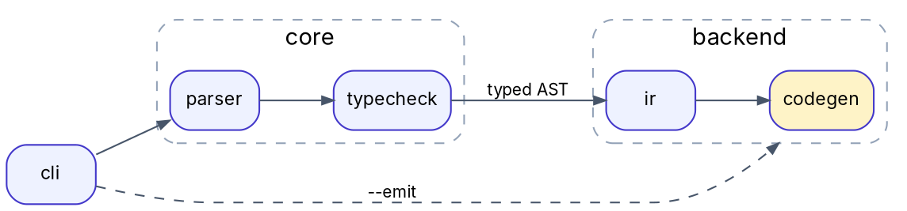

# Graphviz, D2 and PlantUML

Part of `diagrams-as-code` (tool choice, embedding, readability rules, QA). Versions verified there.

## 3. Graphviz (DOT)

```sh
dot -Tsvg deps.dot -o deps.svg; dot -Tpdf deps.dot -o deps.pdf; dot -Tpng -Gdpi=200 deps.dot -o deps.png
dot -Tsvg:cairo deps.dot -o deps_paths.svg                         # glyphs as paths: portable, not selectable
dot -Kneato -Goverlap=false -Gsplines=true -Tsvg net.dot -o net.svg   # undirected/force; sfdp for thousands of nodes
```
- Clusters need the `cluster_` prefix; `compound=true` plus `lhead`/`ltail` points an edge at a cluster.
- A top-level `{rank=same; a; b}` that names clustered nodes pulls them out of their cluster ("cluster named …
  not found"); put rank constraints inside the cluster. With `splines=ortho` use `xlabel` for edge labels.
- Node sizes come from font metrics where `dot` runs: install the named font there, or ship PDF /
  `-Tsvg:cairo`. Generate DOT from scripts as plain text; networkx `write_dot` needs pydot or pygraphviz.

## 4. D2
```d2
direction: right
vars: {d2-config: {layout-engine: elk; theme-id: 0; pad: 20}}
classes: {svc: {style: {border-radius: 6; fill: "#eef2ff"; stroke: "#4338ca"}}}
user: User {shape: person}
cloud: Cloud {
  api: API gateway {class: svc}
  worker: Worker {class: svc}
  db: Postgres {shape: cylinder}
  api -> worker: enqueue
  worker -> db: write
}
user -> cloud.api: HTTPS
cloud.worker -> cloud.api: status {style.stroke-dash: 4}
formula: |latex
  \sum_{i=1}^n x_i = \frac{n(n+1)}{2}
|
cloud.db -> formula
```
```sh
d2 fmt arch.d2 && d2 validate arch.d2
d2 --layout=tala arch.d2 arch.svg          # dagre (default), elk, tala; flags override vars.d2-config
d2 arch.d2 arch.png; d2 arch.d2 arch.pdf  # built-in renderer since 0.9 (older versions downloaded Playwright)
d2 --sketch --theme=0 arch.d2 sketch.svg; d2 --watch arch.d2 arch.svg   # hand-drawn look; live preview
```
- Block strings are raw: single backslashes in `|latex …|` (a `\\` becomes a TeX line break); `|md …|` for
  Markdown labels. SVG output embeds its fonts (Source Sans Pro unless `--font-regular` etc. point to TTFs).
- `--dark-theme ID` adds a prefers-color-scheme variant; `layers`/`scenarios`/`steps` build multi-board
  diagrams. Source moved to github.com/d2lang/d2; `brew install d2` on macOS.

## 5. PlantUML
```text
@startuml
!pragma layout smetana
actor User
participant API
database DB
User -> API: POST /jobs
activate API
API -> DB: INSERT job
API --> User: 202 Accepted
deactivate API
@enduml
```
`plantuml -tsvg seq.puml` (Homebrew wrapper) or `java -jar plantuml.jar -tsvg seq.puml`; also `-tpng`, `-tpdf`.
`!pragma layout smetana` uses the built-in Java port of dot; otherwise class/component layouts need
Graphviz (`-testdot` checks it).

## Pitfalls
| Symptom | Cause | Fix |
|---|---|---|
| D2 LaTeX shows "sum" instead of Σ | `\\` escaping in a raw block | single backslashes |

## Verify
- `dot` prints no warnings; `d2 fmt` and `d2 validate` pass; `plantuml -testdot` passes when layouts need Graphviz.
- Fonts named in the source are installed where rendering happens, or glyphs are exported as paths (`-Tsvg:cairo`).
