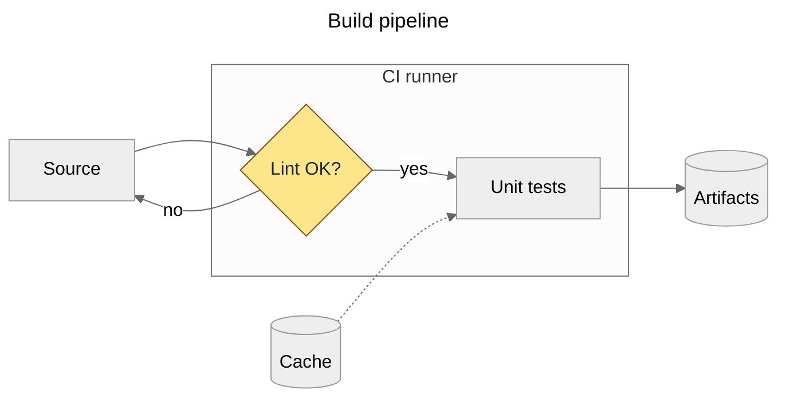

# Mermaid (and Excalidraw)

Part of `diagrams-as-code` (tool choice, embedding, readability rules, QA). Versions verified there.

## 2. Mermaid
- Mermaid 12 bundles ELK and makes it the default layout, and switches flowchart, class, ER, sequence, state
  (and others) to the `redux-color` theme and `neo` look; set `theme: default` and `look: classic` to keep
  the old appearance. It needs Node ≥ 22.12 / Safari 17.4+. GitLab documents Mermaid 11; on GitHub a block
  containing only `info` prints the deployed version. Pin `layout` when the same source renders in several places.
- Front-matter `config:` replaces the older `%%{init: …}%%` directives. Use `flowchart` (not `graph`).

```text
sequenceDiagram                 stateDiagram-v2              erDiagram
  autonumber                      [*] --> Idle                 AUTHOR ||--o{ POST : writes
  participant C as Client         Idle --> Running: start      POST }o--o{ TAG : tagged
  C->>+S: GET /items              Running --> Idle: stop
  S-->>-C: 200 OK                 Running --> [*]: crash
  Note over C,S: TLS at the edge
```
- Labels with punctuation go in quotes (`A["f(x) → y"]`); `%%` starts a comment; a node id `end` in lowercase
  breaks flowcharts (use `End` or another id); math in labels as `"$$x^2$$"` (KaTeX).
- Render with mermaid-cli (`brew install mermaid-cli`, or `npx -p @mermaid-js/mermaid-cli mmdc`):
```sh
mmdc -i flow.mmd -o flow.svg -b transparent
mmdc -i flow.mmd -o flow.png -s 3 -b white            # raster at 3x device scale
mmdc -i flow.mmd -o flow.pdf                          # v12: PDF fits the diagram; --pdf-paper-format A4 for a page
mmdc -i notes.md -o notes.out.md                      # renders every mermaid block, rewrites the Markdown
mmdc -i flow.mmd -o flow.svg -c mermaid.json -C extra.css -p puppeteer.json
```
  v12 replaced `-w/-H` with `--size`, dropped `-f/--pdfFit` (fitting is the default), added `-j/--jobs` and
  `--no-font-embed`. mmdc drives headless Chrome through Puppeteer: "Could not find Chrome" → run
  `npx puppeteer browsers install chrome-headless-shell` or pass `-p` with `{"executablePath": "…"}`;
  as root or in containers add `"args": ["--no-sandbox"]`.
- mmdc SVG uses CSS and `<foreignObject>` HTML labels: fine in browsers, broken in Inkscape/Illustrator and
  SVG→PDF converters (labels vanish, fills go black; `htmlLabels: false` only partly helps). For print or
  vector editing: `mmdc -o flow.pdf`, then `pdftocairo -svg flow.pdf flow.svg` (no CSS, text as paths).

## 7. Excalidraw
Keep `.excalidraw` (JSON) in the repo; export PNG/SVG with "Embed scene" so the image reopens editable (the
VS Code extension edits `*.excalidraw.svg`/`.png` directly). Mermaid can be converted into an editable
Excalidraw scene (`@excalidraw/mermaid-to-excalidraw`, also built into the app). MIT-licensed.

## Pitfalls
| Symptom | Cause | Fix |
|---|---|---|
| Mermaid `Parse error on line N … got 'end'` (browsers show "Syntax error in text") | lowercase `end` id, unquoted `()[]{}` in labels | rename, quote |
| Layout differs on GitHub vs locally | Mermaid 11 (dagre) vs 12 (ELK default) | set `layout`, pre-render |
| Labels missing in Illustrator/Inkscape | `<foreignObject>` HTML labels and CSS | PDF → `pdftocairo -svg` |

## Verify
- `mmdc` exits 0 on every source; the diagram renders the same in the target renderer (pin `layout`; check the forge's Mermaid version).
- `accTitle`/`accDescr` present; vector output for print goes through `pdftocairo -svg`.
